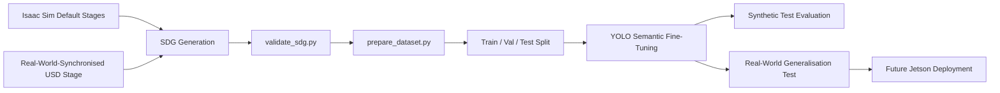

# Sim2Real Drivable Vision Pipeline

Synthetic Data Generation and semantic segmentation pipeline for vision-based robot navigation and future Jetson deployment.

## Overview

This project builds a **drivable-area vision model** intended to sit in front of a robot controller:

```text
Camera
  -> Semantic Segmentation
  -> Drivable / Obstacle Representation
  -> Controller
  -> Robot Motion
```

The model predicts three semantic classes:

| Class ID | Class | Meaning |
|---:|---|---|
| 0 | `background` | Unclassified or non-navigation background |
| 1 | `drivable` | Floor or surface where the robot can move |
| 2 | `obstacle` | Objects or structures that should not be traversed |

The central goal is not only to train a segmentation model, but to create a reusable pipeline covering:

- Isaac Sim synthetic data generation
- semantic-mask validation
- deterministic dataset preparation
- model fine-tuning and evaluation
- sim-to-real improvement using a real-world-synchronised simulation stage
- future deployment to a Jetson-based robot

---

## Motivation

A model trained only on generic synthetic environments can perform well on synthetic validation data while remaining inconsistent on real camera images.

The first model version learned from multiple Isaac Sim environments and achieved strong synthetic test performance, but its predictions on images captured in the target room were not always stable.

To reduce this domain gap, a second training stage was introduced:

1. A simplified version of the target room was created in Blender.
2. A photograph of the real floor was mapped onto the simulated floor material.
3. The room was exported as USD and loaded into Isaac Sim.
4. The floor was labelled as `drivable`.
5. Obstacles, camera poses and scene conditions were randomised.
6. The generated real-room-inspired data was added to the original synthetic dataset.

This combines broad synthetic diversity with target-environment adaptation.

---

## Pipeline



The practical workflow is:

```text
Isaac Sim default stages
+ real-world-synchronised room stage
-> SDG generation
-> validation
-> dataset preparation
-> semantic segmentation fine-tuning
-> synthetic and real-world evaluation
```

---

## Dataset Composition

The current dataset contains four environments:

| Environment | Images |
|---|---:|
| Office | 600 |
| Hospital | 200 |
| Warehouse | 200 |
| Real-room-inspired stage | 500 |
| **Total** | **1,500** |

The prepared dataset uses an 80/10/10 split:

| Split | Images |
|---|---:|
| Train | 1,200 |
| Validation | 150 |
| Test | 150 |

Raw SDG outputs remain separate from the prepared training dataset.

```text
sdg/outputs/
  -> immutable generated RGB images and masks

dataset/drivable/
  -> prepared train / val / test dataset
```

---

## Sim-to-Real Adaptation

The real-room stage was created to address failure cases observed on real camera images.

The stage includes:

- a simplified room layout created in Blender
- a real floor photograph mapped as the floor texture
- semantic tagging of the floor as `drivable`
- randomised obstacle placement
- randomised camera pose
- synthetic RGB and single-channel semantic-mask generation

This does not completely remove the sim-to-real gap. Real cameras still introduce:

- HDR and automatic colour processing
- sensor noise
- lens distortion
- motion blur
- lighting and shadow variation
- unseen objects and materials

However, the real-room-inspired stage makes the training distribution closer to the intended deployment environment.

---

## Model Development

### Version 1

Version 1 was trained using the default synthetic environments.

It showed strong performance on synthetic test images, but real-room predictions were inconsistent in some areas. This indicated that the model had learned the synthetic distribution well but had not fully generalised to the target room.

### Version 2

Version 2 added 500 images from the real-room-inspired stage.

Compared with Version 1, Version 2 produced smoother and more stable predictions on the target room. Some local prediction artefacts still remain, so further work is needed in:

- real-image annotation
- lighting randomisation
- material diversity
- camera matching
- temporal smoothing for video inference

---

## Visual Results

### Version 2 validation labels


### Real-world inference examples


> The image paths above are relative to the repository root. These files must be tracked by Git, or copied into a dedicated `docs/images/` directory, for GitHub to render them.

---

## Project Structure

```text
jetson_model/
├── isaac/
│   ├── room.usd
│   ├── model
│   │   └── basic.glb
│   └── texuture
│       └── floor.jpg
│
├── sdg/
│   ├── configs/
│   │   ├── office.yaml
│   │   ├── hospital.yaml
│   │   ├── warehouse.yaml
│   │   └── real_room.yaml
│   ├── outputs/
│   ├── generate_data.py
│   ├── semantic_mask_writer.py
│   └── run.sh
│
├── dataset/
│   ├── drivable/
│   │   ├── images/
│   │   │   ├── train/
│   │   │   ├── val/
│   │   │   └── test/
│   │   ├── masks/
│   │   │   ├── train/
│   │   │   ├── val/
│   │   │   └── test/
│   │   └── drivable.yaml
│   └── generalization/
│
├── model/
│   ├── pretrained/
│   └── finetuned/
│
└── training/
    ├── validate_sdg.py
    ├── prepare_dataset.py
    ├── runs/
    └── evaluations/
```

---

## Data Format

Each RGB image has a matching single-channel PNG semantic mask.

```text
image: frame_000001.png
mask:  frame_000001.png
```

Mask pixel values:

```text
0 = background
1 = drivable
2 = obstacle
```

The coloured segmentation images shown during inference are visualisations only. Training masks store integer class IDs, not display colours.

---

## Running the Pipeline

### 1. Generate SDG data

```bash
cd ~/personal_project/jetson_model
bash sdg/run.sh
```

### 2. Validate generated RGB and masks

```bash
python3 training/validate_sdg.py
```

Validation checks:

- equal RGB and mask counts
- matching file stems
- matching image sizes
- single-channel masks
- allowed mask values: `0`, `1`, `2`
- per-class pixel distribution

### 3. Prepare the training dataset

```bash
python3 training/prepare_dataset.py --overwrite
```

This combines all environments, prefixes filenames to avoid collisions, and creates deterministic train/validation/test splits.

### 4. Activate the training environment

```bash
source .venv/bin/activate
```

Confirm that the project-local YOLO executable is active:

```bash
which yolo
```

Expected path:

```text
.../jetson_model/.venv/bin/yolo
```

### 5. Train Version 2

```bash
yolo semantic train \
  model=model/pretrained/yolo26n-sem.pt \
  data=dataset/drivable/drivable.yaml \
  epochs=50 \
  imgsz=640 \
  batch=8 \
  device=0 \
  workers=4 \
  patience=10 \
  save_dir=/home/eun/personal_project/jetson_model/training/runs/full_v2
```

### 6. Evaluate on the held-out synthetic test set

```bash
yolo semantic val \
  model=training/runs/full_v2/weights/best.pt \
  data=dataset/drivable/drivable.yaml \
  split=test \
  imgsz=640 \
  batch=8 \
  device=0
```

### 7. Run real-world inference

```bash
yolo semantic predict \
  model=training/runs/full_v2/weights/best.pt \
  source=dataset/generalization/real/images \
  imgsz=640 \
  device=0 \
  save=True \
  project=training/evaluations \
  name=real_v2 \
  exist_ok=True
```

---

## Current Status

Completed:

- multi-environment Isaac Sim SDG
- semantic RGB/mask generation
- SDG validation
- deterministic dataset preparation
- YOLO semantic fine-tuning
- synthetic test evaluation
- real-room-inspired USD stage
- qualitative real-world comparison between model versions

Next steps:

- annotate a small real-image dataset
- fine-tune with mixed synthetic and real data
- evaluate quantitative real-world mIoU
- export to ONNX and TensorRT
- benchmark on Jetson
- connect segmentation output to the controller
- add temporal smoothing for video inference

---

## Key Takeaway

The project demonstrates a complete sim-to-real vision workflow:

> Generate diverse synthetic data, identify real-world failure cases, reproduce the target environment in simulation, add targeted synthetic data, and retrain the model to reduce the domain gap.

The main engineering value is the repeatable pipeline connecting simulation, data validation, dataset preparation, fine-tuning, real-world evaluation and future edge deployment.
